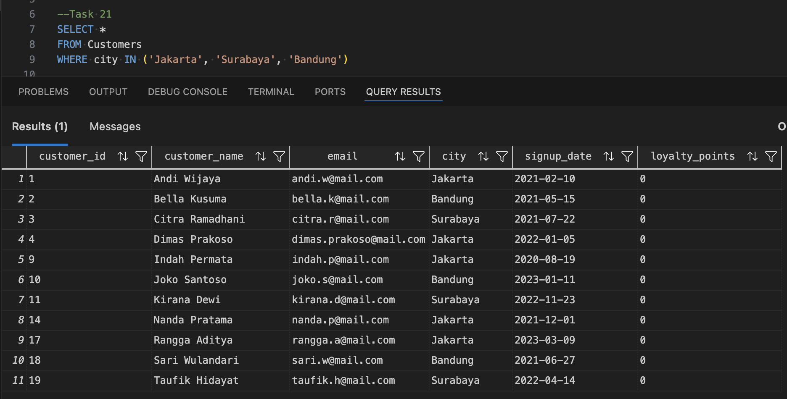
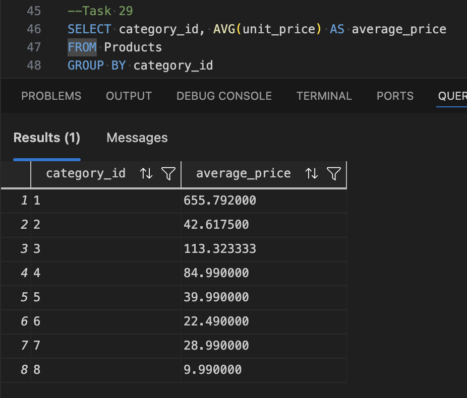
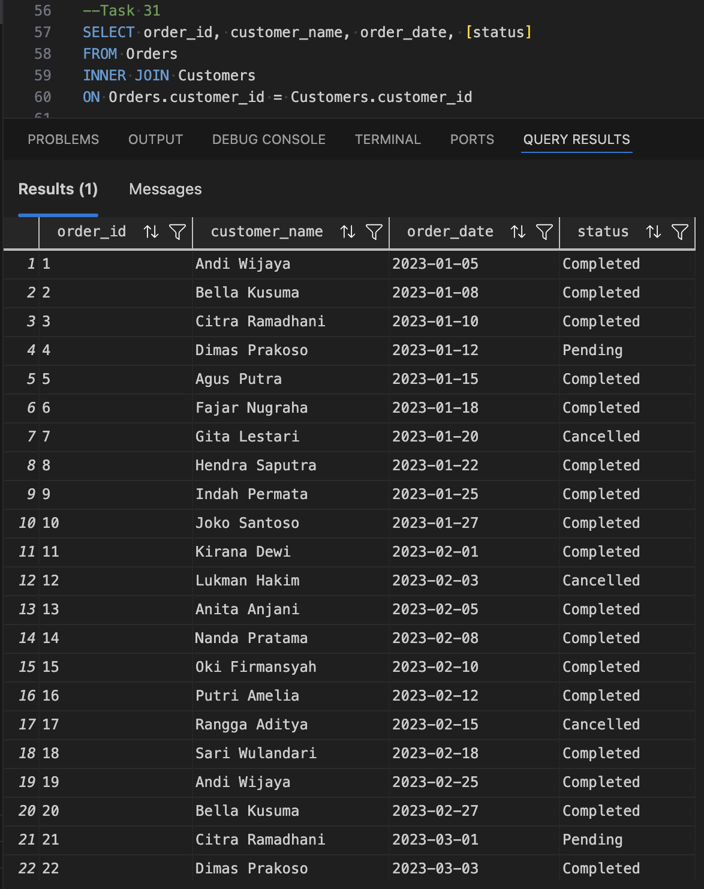
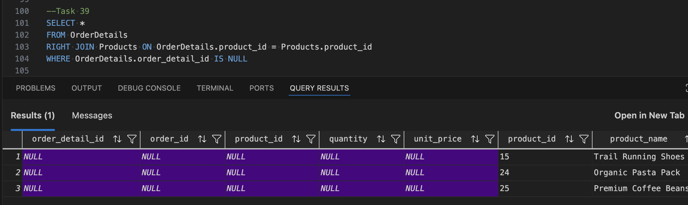
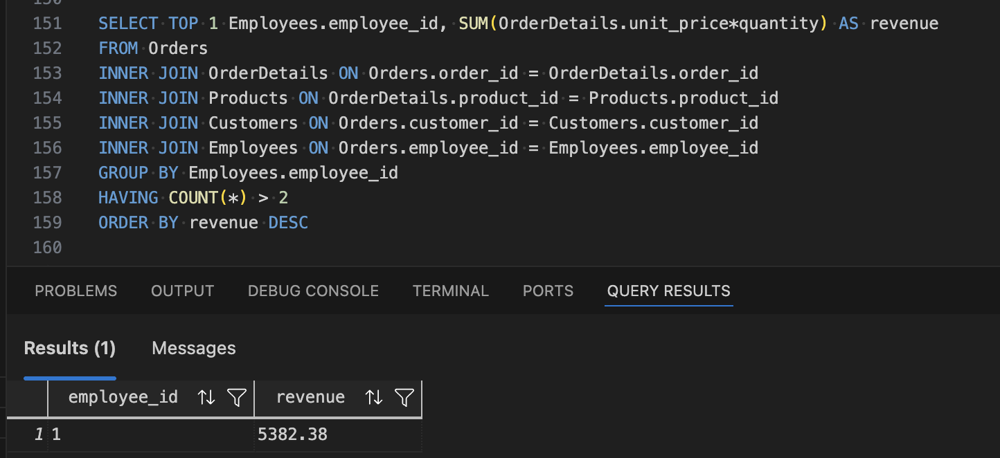

# UrbanCart Retail Store

A relational SQL portfolio project built around JOINs, on a fictional retailer's data

---

## Why This Project Exists

After finishing BookNook and PixelMart, I still hadn't touched the thing most junior SQL interviews actually test: relationships between tables. Both of those projects were deliberately single-table exercises — no foreign keys, no JOINs. This one exists specifically to fill that gap.

I invented UrbanCart, a fictional retail store, and built out a proper relational schema around it: customers, employees, categories, suppliers, products, orders, and the order line items that connect them all. Every name, product, and transaction here is made up — there's no real company behind this, and no real people or data anywhere in the repo.

The goal was to go through every JOIN type — inner, left, right, full, anti-joins, cross joins, and multi-table chains — against a schema that actually needed them, not a toy example. Each query was reviewed like an interview answer before I moved on: checked for correctness, pushed on style, and scored honestly. A few mistakes repeat in that process (ambiguous column names after joining tables that share a column, using the wrong table's price column for a revenue calculation, forgetting `GROUP BY` before referencing a non-aggregated column) — I left the corrected versions in the query files, since working through those mistakes is part of what this project actually demonstrates.

## What Is Inside

Seven tables: `Categories`, `Suppliers`, `Employees`, `Customers`, `Products`, `Orders`, and `OrderDetails`. Unlike my earlier projects, this schema is built around real foreign key relationships — `Products` references `Categories` and `Suppliers`, `Orders` references `Customers` and `Employees`, and `OrderDetails` is the bridge table that lets a single order contain multiple products.

The data was seeded with deliberate gaps for practice purposes — two customers with zero orders, and a few products that have never been ordered — so the anti-join challenges have real rows to find instead of coming back empty by luck.

Work is organized into four stages: building the schema, populating it, a handful of realistic maintenance tasks (adding a column, correcting a customer record, discontinuing a product, giving an employee a raise, cancelling an order), and finally 24 SQL challenges split Easy → Medium → Hard, ending with a 5-table JOIN that reports the top-revenue employee.

## Technical Stack

[](https://www.microsoft.com/en-us/sql-server)
[](https://learn.microsoft.com/en-us/sql/t-sql/language-reference)
[](https://code.visualstudio.com/)
[](https://www.docker.com/)

Everything runs against a local SQL Server instance in a Docker container, with queries written and executed directly in VS Code using the MSSQL extension.

## Getting It Running

You'll need a SQL Server instance available — I ran mine in a local Docker container.

Clone this repository, then run the setup scripts in order:

```
database/schema.sql          # creates the database and all 7 tables, in dependency order
database/sample_data.sql     # loads categories, suppliers, employees, customers, products, orders, and order details
```

From there:
- `queries/modifications.sql` has the ALTER/UPDATE/DELETE maintenance tasks
- `queries/challenges.sql` has all 24 SELECT/JOIN challenges, Easy through Hard

## Project Organization

```
urbancart/
├── database/
│   ├── schema.sql            # 7 CREATE TABLE statements, dependency-ordered
│   └── sample_data.sql       # sample data for all 7 tables
├── queries/
│   ├── modifications.sql     # ALTER / UPDATE / DELETE tasks
│   └── challenges.sql        # all 24 SELECT/JOIN challenges, Easy → Hard
├── er_diagram.md              # entity-relationship diagram + design reasoning
├── er_diagram.svg              # the diagram itself
├── screenshots/                # a handful of query results, for a quick look
└── README.md                   # you are here
```

## Entity-Relationship Diagram

See [`er_diagram.md`](er_diagram.md) for the full diagram and the reasoning behind each design decision — including why `OrderDetails` stores its own `unit_price` separately from `Products.unit_price` (an order needs to remember what the customer actually paid, not today's price), and why table creation has to follow dependency order.

## Screenshots

### Filtering with WHERE and BETWEEN (Task 21)


### GROUP BY with an aggregate function (Task 29)


### My first INNER JOIN (Task 31)


### A RIGHT ANTI JOIN — products that have never been ordered (Task 39)


### Final report — a 5-table JOIN finding the top employee by revenue (Task 43)


## Important Disclaimers

This is a learning project. Every customer, employee, product, and order in this database is fictional — none of it represents a real business, real people, or real transactions.

This repo demonstrates relational SQL fundamentals, not production database design. There are no subqueries, CTEs, window functions, views, stored procedures, or indexes by design — those are deliberately out of scope here and are the natural next step.

## Future Possibilities

Some ideas for extending this once I'm further along:

1. Rewrite some of the JOIN-based challenges as subqueries or CTEs and compare readability and performance
2. Add a `CASE` statement to bucket orders into size categories (small/medium/large) based on revenue
3. Turn the Task 43 report into a view, so it doesn't need to be rewritten every time someone wants to check it
4. Wrap the Task 27 restock logic into a stored procedure
5. Add indexes on the foreign key columns and measure the difference on a much larger synthetic dataset
6. Explore window functions for a running total of revenue by order date

## Acknowledgments

Built as a step up from two earlier single-table projects, specifically to practice relational thinking — foreign keys, JOINs, and the kind of multi-table reasoning that shows up in most real SQL interviews.
