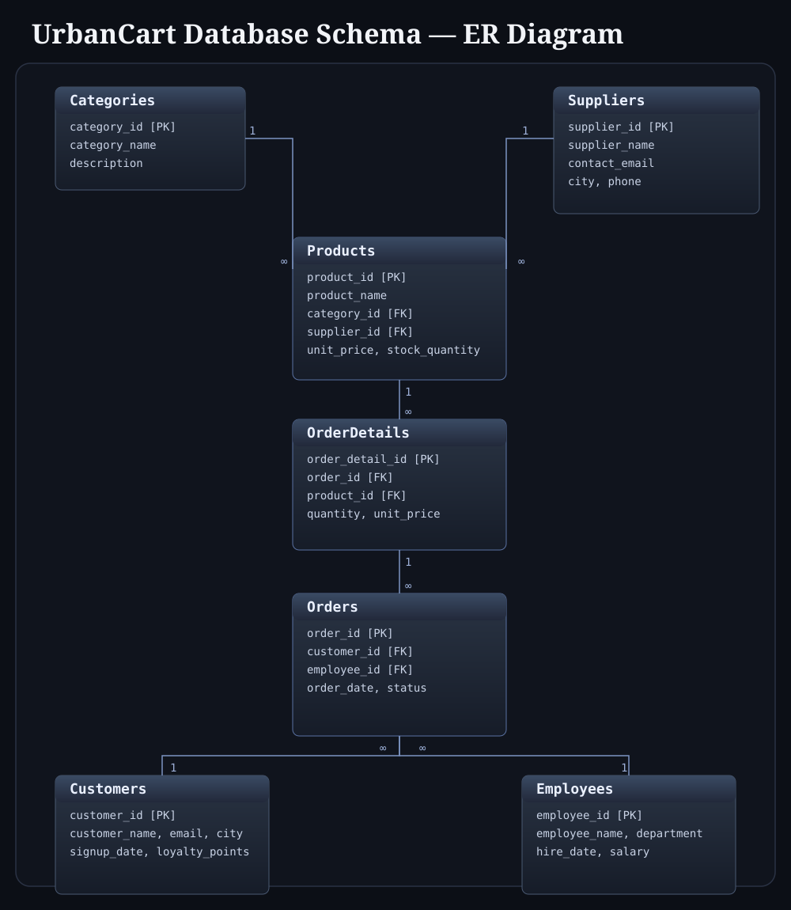

# UrbanCart — Entity-Relationship Diagram & Design Notes

## ER Diagram

Reading it: one `Category` has many `Products`; one `Supplier` supplies many `Products`; one `Product` appears in many `OrderDetails` rows; one `Order` has many `OrderDetails` rows; one `Customer` places many `Orders`; one `Employee` processes many `Orders`.

## Tables

**`Categories`** — category_id (PK), category_name, description

**`Suppliers`** — supplier_id (PK), supplier_name, contact_email, city, phone

**`Employees`** — employee_id (PK), employee_name, department, hire_date, salary

**`Customers`** — customer_id (PK), customer_name, email, city, signup_date, loyalty_points

**`Products`** — product_id (PK), product_name, category_id (FK → Categories), supplier_id (FK → Suppliers), unit_price, stock_quantity

**`Orders`** — order_id (PK), customer_id (FK → Customers), employee_id (FK → Employees), order_date, status

**`OrderDetails`** — order_detail_id (PK), order_id (FK → Orders), product_id (FK → Products), quantity, unit_price

## Design Decisions

**Why `OrderDetails` has its own `unit_price` instead of just looking up `Products.unit_price`:**
This is a real-world pattern, not redundancy for its own sake. Product prices change over time, but an order is a historical record — you need to know what the customer *actually paid* at the moment of purchase, not what the product costs today. Without this, changing a product's price later would silently rewrite the financial history of every past order that referenced it. Task 43's final report specifically relies on this distinction: revenue is calculated from `OrderDetails.unit_price` (the price paid), not `Products.unit_price` (the current price).

**Why `status` and `department` are plain VARCHAR instead of separate lookup tables:**
A more "normalized" design would put `OrderStatus` and `Department` in their own tables with foreign keys. They're kept as simple text columns here deliberately — every table in this schema earns its place in at least one JOIN challenge, and adding more tables than the JOIN exercises actually need would pad the schema without adding practice value.

**Why every table uses a single-column surrogate primary key (`*_id`)** rather than a "natural" key (like using `email` as `Customers`' primary key):
Surrogate integer keys are the standard convention in real systems — they're stable even if other details (email, name) change, and they keep every foreign key relationship simple and consistent to write.

**Why `OrderDetails` exists as its own table instead of `Orders` having a `product_id` directly:**
An order can contain multiple products — you don't place a separate "order" every time you add an item to a cart. `OrderDetails` is the bridge that lets one `Order` reference many `Products`, each with its own quantity and price. This many-to-many resolution pattern is specifically what makes the 4- and 5-table JOIN challenges (Tasks 42–43) possible in a meaningful way.

**Why table creation order matters:**
Because `Products`, `Orders`, and `OrderDetails` all have foreign keys pointing at other tables, they must be created *after* the tables they reference. Creation order: `Categories` → `Suppliers` → `Employees` → `Customers` → `Products` → `Orders` → `OrderDetails`.
